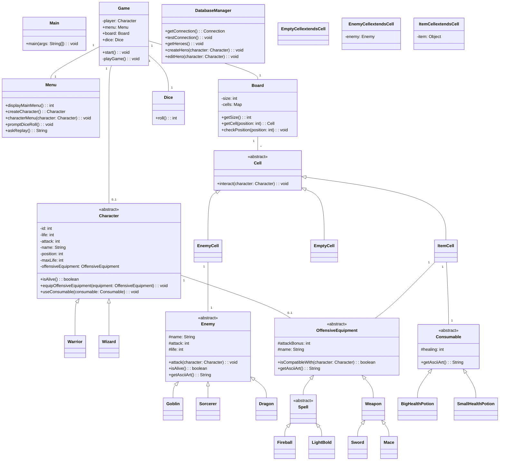

# Donjons & Dragons - Jeu Java

## Description du projet

Le but de ce projet est de créer un jeu inspiré des jeux de plateau de l’univers **Donjons & Dragons**, en utilisant le langage **Java**.  
Ce projet se découpe en plusieurs itérations, au cours desquelles de nouvelles fonctionnalités seront ajoutées.

Le jeu fonctionne dans la **console de l’IDE**. Il affiche les informations et le joueur peut saisir des instructions telles que :  
choisir la classe du personnage, nommer le personnage, lancer un dé, ou quitter le jeu.

---

## Table des matières
1. [Règles du jeu](#règles-du-jeu)
2. [Le plateau de jeu](#le-plateau-de-jeu)
3. [Personnages](#personnages)
4. [Caisses surprises](#caisses-surprises)
5. [Équipements offensifs](#équipements-offensifs)
6. [Ennemis](#ennemis)
7. [Déroulement du jeu](#déroulement-du-jeu)
8. [Règles des combats](#règles-des-combats)
9. [Fin de partie](#fin-de-partie)
10. [Installation et exécution](#installation-et-exécution)
11. [UML & Organisation du projet](#uml--organisation-du-projet)
12. [Diagramme UML](#diagramme-uml---jeu-donjons-et-dragons)
---

## Règles du jeu

Le joueur doit faire traverser le plateau à son personnage.  
Sur son chemin, il rencontrera des **ennemis**, des **armes** et des **bonus**.  
La partie est réussie si le joueur atteint la fin du plateau vivant.

---

## Le plateau de jeu

- Le plateau est constitué de **64 cases**.
- Chaque case peut être :
    - Vide
    - Contenir un **ennemi**
    - Contenir une **caisse surprise**

---

## Personnages

Au début de chaque partie, le joueur choisit un personnage et lui donne un nom.

| Classe     | Vie | Attaque |
|------------|-----|---------|
| Guerrier   | 10  | 5       |
| Magicien   | 6   | 8       |

---

## Caisses surprises

- Contiennent des objets : **équipements offensifs** ou **potions**.
- Les équipements ne sont ajoutés au personnage que si :
    - le personnage est compatible
    - le nouvel équipement est plus avantageux que l’actuel

---

## Équipements offensifs

### Armes (Guerrier)
- **Massue** : +3 attaque
- **Épée** : +5 attaque

### Sorts (Magicien)
- **Éclair** : +2 attaque
- **Boule de feu** : +7 attaque

### Potions (Tous)
- **Potion de vie standard** : +2 points de vie
- **Grande potion de vie** : +5 points de vie

---

## Ennemis

| Ennemi   | Attaque | Vie |
|----------|---------|-----|
| Sorcier  | 2       | 9   |
| Gobelin  | 1       | 6   |
| Dragon   | 4       | 15  |

---

## Déroulement du jeu

- Le jeu se joue **tour par tour**.
- À chaque tour, le joueur lance un **dé à 6 faces** pour déterminer le nombre de cases avancées.

Selon la case atteinte :
- **Vide** : le tour suivant commence
- **Caisse surprise** :
    - Equipement → ajouté si compatible et avantageux
    - Potion → points de vie récupérés
- **Ennemi** → un combat se déclenche

---

## Règles des combats

- Le personnage frappe l’ennemi selon son attaque + bonus d’équipement.
- Si l’ennemi tombe à 0 vie → mort et disparition du plateau
- Sinon l’ennemi riposte et diminue la vie du personnage, puis s'enfuit
- La vie de l’ennemi reste **persistante** sur sa case

---

## Fin de partie

- **Gagnée** : le joueur atteint la fin du plateau
- **Perdue** : le joueur perd tous ses points de vie

---

## Installation et exécution

### Prérequis

- [Java JDK](https://www.oracle.com/java/technologies/javase-jdk17-downloads.html) 17 ou supérieur installé
- Un terminal ou invite de commandes
- (Optionnel) Un IDE comme IntelliJ, Eclipse ou VS Code pour modifier/ouvrir le projet
1. Cloner le projet :
   ```bash
   git clone https://github.com/CharlottePinoit/JAVA_donjons-dragons.git
   cd JAVA_donjons-dragons
   ```
1. Compiler le projet :
   ```bash
   javac -d out -sourcepath src src/**/*.java
   ```
1. Compiler le projet : depuis le dossier out
   ```bash
   java Main
   ```
---

## UML & Organisation du projet

Le projet est organisé autour des principales classes suivantes :

- **Personnage** (superclasse) → `Guerrier`, `Magicien`
- **Ennemi**
- **Equipement**
- **Case** → contient Ennemi, Equipement ou vide
- **Plateau** → tableau de 64 cases
- **De** → gestion du lancer de dé
- **Combat** → gère le combat entre personnage et ennemi
- **ui.Menu** → interaction utilisateur (affichage, saisie)
- **Jeu** → coordination générale des tours, déplacements, combats et fin de partie

# Diagramme UML - Jeu Donjons et Dragons

---

